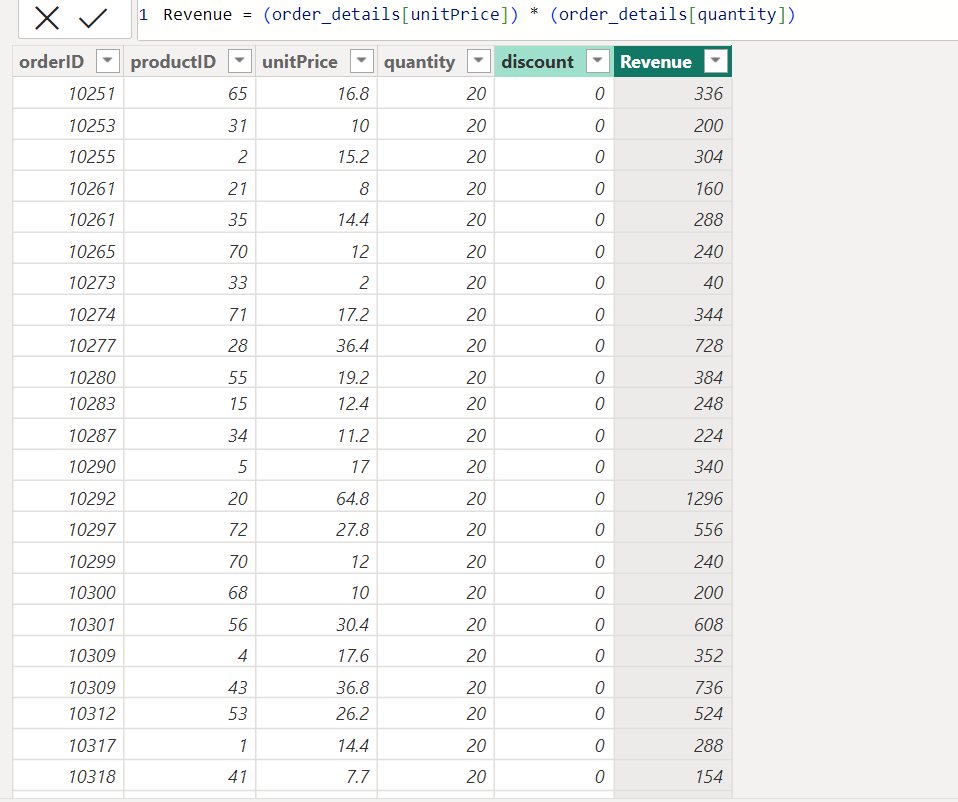
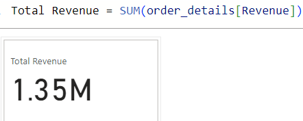
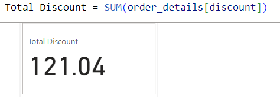
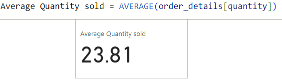
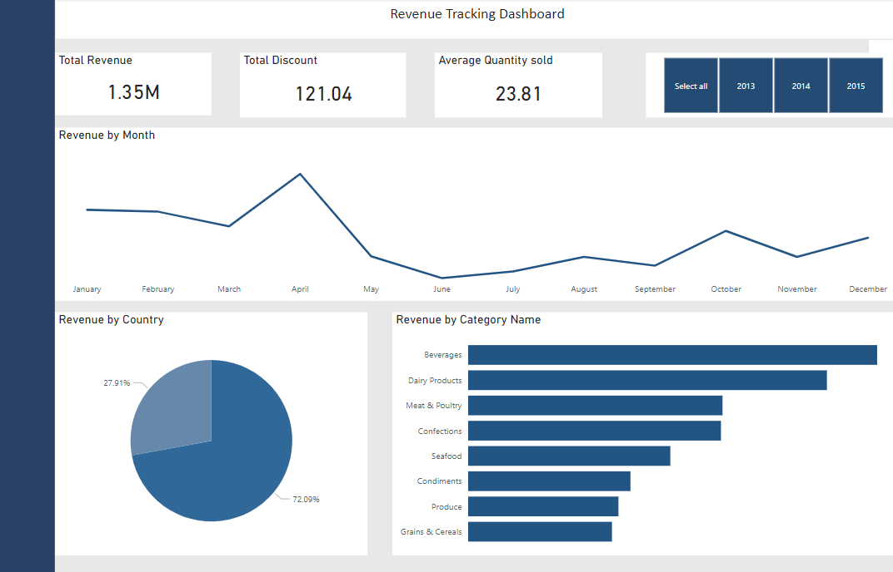

### Data Analysis, Modeling, and Visualization

#### Introduction:

Data analysis, modeling, and visualization form the core of modern data-driven decision-making. In this process, data is transformed into meaningful insights that guide strategic decisions and It's about uncovering the "what" and "why" behind the numbers. 

Also, it has substantial value by simplifying complex information and has become an indispensable tool for both businesses and individuals.
In this project, meaningful insights have been uncovered using the Northwind Traders dataset, enabling organizations to make informed decisions and drive innovation.

#### Problem Statement:
You are to work extensively on the northwind traders dataset
Come up with questions you wish to answer with that data 
Model, analyze and visualize your insights.

#### Generated Questions:
1. Create a column showing the revenue and a measure for the total revenue
2. Create a measure showing the overall unit discount in order details table
3. Create a measure showing the average quantity of products sold
4. Create a dashboard to visualize the total revenue grouped by month, country, and category name

#### Results/Discussion:

The Snapshot displays a created column for Revenue and the Dax function used is as follows:

_Revenue = (order_details[unitPrice]) * (order_details[quantity])_

And 

The screenshot above shows the total revenue from product sales and the DAX function used is as follows:

_Total Revenue = SUM(order_details[Revenue])_

The screenshot above indicates the total discount from the order_details table and the DAX function used is as follows; 

_Total Discount = SUM(order_details[discount])_

The screenshot above shows the average quantity of products sold and the DAX function used is as follows;

_Average Quantity sold = AVERAGE(order_details[quantity])_

The Revenue Tracking Dashboard provides a comprehensive view of the financial performance of Northwind Traders' products, and some key insights derived include: 

##### Revenue by Month Insights:
The dashboard illustrates the total revenue on a monthly basis, revealing that April stands out as the highest revenue-generating month. This insight is crucial for understanding seasonal variations and marketing strategies accordingly. 

##### Revenue by Country Insights:
This analysis helps to identify geographical areas of strength and areas where growth opportunities may exist. In this dashboard, the USA emerges as the top revenue-generating country. from the analysis, The next logical question should be why the USA outperforms other countries. Are there specific regions or demographics within the USA that are more active buyers? These insights would facilitate informed-decisions and actions.

##### Revenue by Category Name:
Beverages emerge as the top revenue-generating category. This highlights a product category with strong market demand.

##### Year-based Slicer:
The inclusion of a year slicer is a relevant tool for detailed analysis. This feature aids in analyzing yearly trends, comparing performance across different years. The feature is also useful for forecasting and setting financial targets.

#### Conclusion:
this dashboard equips Northwind Traders with valuable insights into revenue patterns, empowering decision-makers to take meaningful actions for the company's growth and success.

